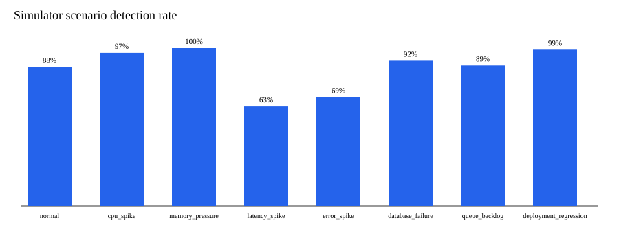

# Local Evaluation Results

The measured result set is [`experiments/results/local-evaluation-results.json`](../../experiments/results/local-evaluation-results.json).
It was executed locally on 2026-09-18 using Python 3.13.5 and scikit-learn
1.9.0 on Windows 11. Values below are derived from that raw file, not
hand-entered targets.

Experimental configuration: Isolation Forest with contamination 0.02, random
state 42, 1,000 training samples, simulator seed 20260914, 100 samples per
scenario (800 total). Ground truth is synthetic: `normal` is negative (100
samples) and the seven incident scenarios are positive (700 samples).

## Confusion matrix

|  | Predicted negative | Predicted positive |
| --- | ---: | ---: |
| Actual negative | TN = 12 | FP = 88 |
| Actual positive | FN = 91 | TP = 609 |

## Aggregate metrics

| Metric | Measured value |
| --- | ---: |
| Precision | 0.8737 |
| Recall | 0.8700 |
| F1 | 0.8719 |
| False-positive rate | 0.8800 |
| False-negative rate | 0.1300 |

The detector identified 609 of 700 synthetic incident events, but also marked
88 of 100 synthetic normal events anomalous. The high false-positive rate
(0.88) is a genuine measured outcome of the current experimental setup and a
material negative result: these measurements do not support operational use
without recalibration and more representative normal training data. The ground
truth is synthetic, so this experiment must not be interpreted as production
monitoring performance.

## Per-scenario detection

| Scenario | Ground truth | Detected | Rate |
| --- | --- | ---: | ---: |
| normal | negative | 88 / 100 | 0.88 |
| cpu_spike | positive | 97 / 100 | 0.97 |
| memory_pressure | positive | 100 / 100 | 1.00 |
| latency_spike | positive | 63 / 100 | 0.63 |
| error_spike | positive | 69 / 100 | 0.69 |
| database_failure | positive | 92 / 100 | 0.92 |
| queue_backlog | positive | 89 / 100 | 0.89 |
| deployment_regression | positive | 99 / 100 | 0.99 |

## Inference latency (per-scenario mean)

The harness reports only the per-scenario **mean** inference latency (ms). It
does **not** provide per-event p50/p95/p99.

| Scenario | Mean inference latency (ms) |
| --- | ---: |
| normal | 0.1014 |
| cpu_spike | 0.0860 |
| memory_pressure | 0.0937 |
| latency_spike | 0.0815 |
| error_spike | 0.0821 |
| database_failure | 0.0776 |
| queue_backlog | 0.0780 |
| deployment_regression | 0.0800 |

## In-memory pipeline latency

Measured over 100 in-process validation/routing calls:

| Metric | Value (ms) |
| --- | ---: |
| Mean | 0.1777 |
| p50 | 0.0879 |
| p95 | 0.1114 |
| p99 | 1.8037 |

## Sequential API `/health/live`

Process-local TestClient requests with zero HTTP errors. These are not network
or Kubernetes load-test results.

| Requests | Throughput (req/s) | Error rate | p50 (ms) | p95 (ms) | p99 (ms) |
| --- | ---: | ---: | ---: | ---: | ---: |
| 50 | 342.2 | 0% | 2.60 | 3.71 | 4.13 |
| 200 | 343.8 | 0% | 2.58 | 4.57 | 5.41 |
| 500 | 332.3 | 0% | 2.85 | 4.46 | 4.90 |

## Observability

Metric families for anomalies, ML inference, and processed telemetry were
emitted (`metrics_emitted = true`). Prometheus/Grafana alert delivery was not
evaluated by the local harness; this is by design and documented in
[limitations.md](limitations.md).

See [reproducibility.md](reproducibility.md) for run-to-run reproducibility and
[limitations.md](limitations.md) for measurement scope.